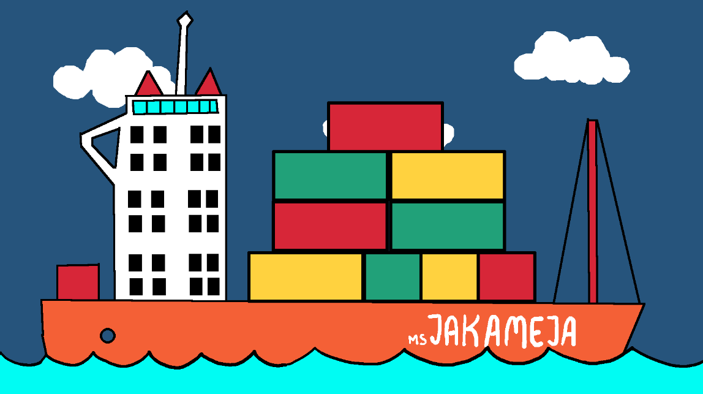
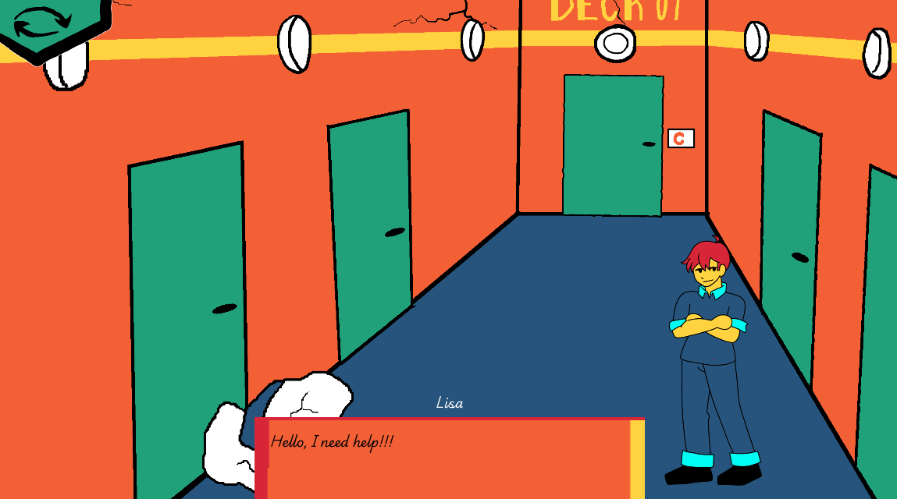
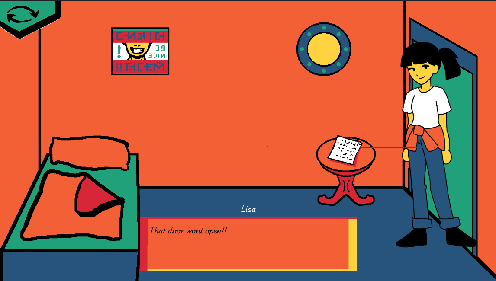
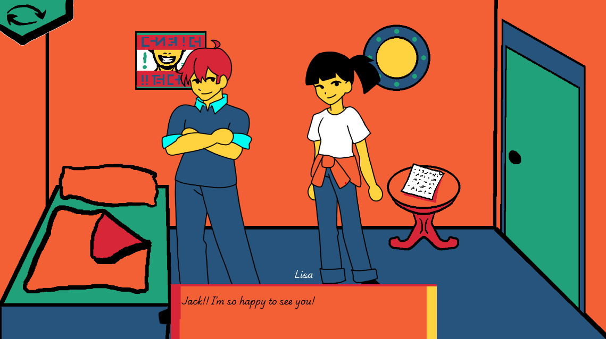

# BrainAndGut
Brain and Gut is a point-and-click adventure created in Godot for the GoedWare Game Jam

**The game is available on itch.io. Play it here:** TODO: add link

## Game description

Step into the shoes of a survivor in "Brain and Gut," a thrilling 2D point-and-click adventure. Navigate through the wreckage and solve intricate puzzles. Use your wit and strength to overcome challenges and piece together the story of what happened.

Game Jam: "Brain and Gut" was created for the GoedWare Game Jam Limited Colors edition, showcasing creativity and innovation within the constraints of a limited color palette

### Controls

Mouse for movement and interacting with objects.

## Requirements

Software what you need is:

* [Godot 4 (4.3 or better)](https://godotengine.org/)
* [Visual Code (optional)](https://code.visualstudio.com/Download)

That's all :)

## Used Assets

All graphics, sounds and music assets were created by:
* [Meru](https://merulon.itch.io/)
* [Kaya](https://hatsune-miku-desu.itch.io/).

Voice actors:
* Voice Actors: The Honourable Fish as Jack, ZoraLune as Lisa

## Team

- [**Jan Mesarč**: Programmer](https://janmesarc.online/)
- [**Jakub Hubáček**: Programmer](https://hubacekjakub.itch.io/)
- [**Meru**: Artist and Composer](https://merulon.itch.io/)
- [**Kaya**: Artist](https://hatsune-miku-desu.itch.io/)

### Screenshots

